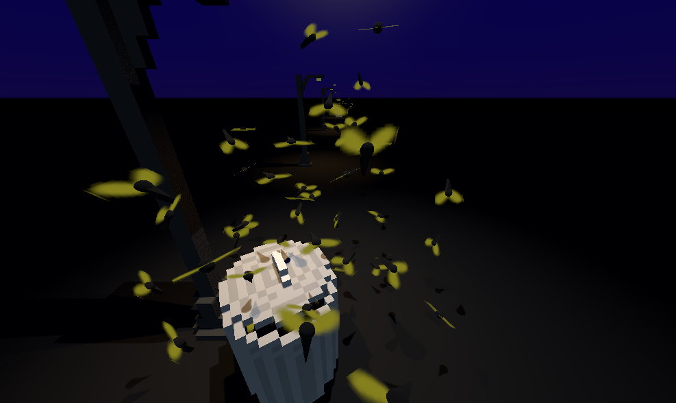

# Bugoids3D

This is a simple implementation of Boids in 3d using the Godot Game Engine. They behave much more like bugs with their tuning. The tuning is very easy to adjust in order to get the standard boid behavior.

